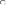

# One-way labyrinth generator

This program aims to solve the following challenge: 
"Draw a line that goes through an n x n grid (where n is an odd number), passing through each field once. The line has to start from the field at the upper left corner (1,1) and end at (n,n). At any time it is allowed to move left, right, up or down, and it has to randomly choose between the available fields."

At first sight it may look easy. But look at the following example:

The program calculated the blue lines, they are necessary to go through in the future based on how the black line was drawn. 
Do you see why the board is impossible to fill from now on?

The question is, is there a single rule or a set of rules that will guarantee you can draw a labyrinth of any size? Or do the rules get infinitely complex?

In the beginning of the project I let the program run on a 21 x 21 field, and whenever I noticed a trouble, I coded the solution into it. While you can discover many patterns this way, a gradual approach may be more effective.

A 3 x 3 area can only be filled in two ways, like this and mirrored:

The 5 x 5 requires much more consideration. Whenever it is possible to draw future lines, the program has to be able to do it. The future lines can not only extend at each step but connect too.

<!-- specify extension and connection rules -->

By August 21, 2023 all 5 x 5 scenarios were discovered. The number of walkthroughs are 104. 
Here are the things to consider on a grid of this size:

<!-- change -->

- A single field next to the live end that is walled from two other sides (either by the border or the line) needs to be filled in the next step. I call it C-shape. The pattern is both mirrored and rotated, so that the empty field is straight ahead. To qualify for this rule, the empty field cannot be the end corner. If there is a C-shape, we don't need to check other rules.

- Movement near the edge: In the example, we cannot step left (3,5), since the (2,5) field is empty. 

- A 2 x 3 empty area next to the live end that is walled by three sides (2-3-2 long) will have a future line going through along the walls. At the wall next to the main line, its direction is the opposite of the main line, meaning it will go from (3,2) upwards whereas the main line just took a step downwards. How the middle field will be filled is not yet known. Either the near end (the one the main line will go through first) or the far end can fill it.

- A 2 x 2 empty area next to the live end that is walled by three sides (2-2-2 long) will have a future line going through along the walls. In this example, the far end is already extended by one step as it had only one option to move.

- Future line extension: If there was a near end where the main line was in the previous step, it now may have only one choice to move, so it can be extended.

- Future line connection: In this case, the line being stepped on extends until the far end has two options. (When the end corner is one of them, it has to be removed.) Then, the line on the left extends and now has no other option than to connect to the line on the right. 

- When we are two distance away from the edge, we need to check if stepping towards it is possible.
It is because if we do so, an enclosed area is created, with one way to go out of it. If that area has an impair amount of cells, it cannot be filled, so we cannot take that step. 
The explanation is simple: Imagine if the table was a chess board. In order to step from white to black, you would need to take an impair amount of steps - the color changes at every step. Here, the entry of the area would be (4,3) and the exit (5,3). An impair amount of steps means pair amount of cells. 
In the example, you can also say that we cannot step right, because there is a future line start 2 to straight and an end 2 to straight and 2 to right. On 7 x 7, there will be examples where this is the rule we have to apply, because area counting is not getting triggered: 

But let's start with the simpler rules:

- Future line extension: When a near end is at 2 distance left or right from the live end, it will fill the field between them if the live end steps elsewhere. That's what happened above before the line failed.

In other situations, there is a 1-thin future line next to the live end that can be extended if its far end is at the corner. Though disabling this rule does not affect the total amount of walkthroughs on a 7 x 7 grid, I chose to include it in the project on the basis that if a future line can be extended, we should do it. It can make a considerable difference. The left picture is without the rule, the right is with it.

- Just like moving near the edge, we need to disable some fields if we are approaching an older section of the main line. In order to determine on which side the enclosed area is created, we need to examine the direction of the line at the connection point.

Impair areas can now happen inside the grid, not just on the edge.

- When we are entering or moving in an enclosed area, the above rules define movement near the edge.

- This is what I started the 7 x 7 introduction with.

- And these are the remaining size-specific rules.

The program, in fast mode, can run through approximately 100 cases per second, depending on your computer speed. This enables us to discover all 7 x 7 walkthroughs, which is 111 712. 
It is equal to what is described in the Online Encyclopedia of Integer Series (Number of simple Hamiltonian paths connecting opposite corners of a 2n+1 x 2n+1 grid).

As the sizes grow, it will be impossible to run through all cases with one computer in a reasonable time. In order to discover the patterns, we need to run the program randomly.

Is it possible to develop an algorythm that works for all sizes? The edge-related and area-counting rules are universal, but the size-specific rules get more and more complex. Can you define them with one statement?

I have made statistics about how many random walkthroughs you can complete on different grids using the 7 x 7-specific and the universal rules before running into an error. Based on 1000 attempts, here are the results: 
9: 16.7 
11: 4 
13: 1.8 
15: 0.9 
17: 0.4 
19: 0.2 
21: 0.1

To discover 9-specific patterns, I run the program keeping it left as long as the time to get to the first error is too big. After that, I will run it randomly. Right now, the first 13 826 walkthroughs are completed before we encounter a situation. It is similar to the last one we discovered on 7 x 7:

Let's simplify the pattern. Which will be impossible to fill?

It is the picture on the left. Since the yellow-bordered area is impair, adding the (4,2) (4,3) (4,4) fields will be pair. We enter the area at (4,4), so we will exit at (4,3). Now we enter the 3 x 3 area in the top left corner at its side, (3,3) and will exit at (2,4). The results is two C-shapes on each side:

We can define a rule by marking the following fields and counting the area from the fields in front of the main line to the right:

Start field is (4,4) in the actual example. End_1 field is (4,2), End_2 field is (4,3). Direction of the circle: right (counter-clockwise). If the area is pair, it cannot be filled. 

---

The project contains the source code for use with Visual Studio. To start the program, run OneWayLabyrinth.exe in the folder "bin/Debug/net6.0-windows".

---

Hotkeys:

Enter: Reload or Close error message 
Ctrl + S: Save path 
Right arrow: Step forward 
Left arrow: Step back 
Ctrl/Shift + arrows: step in direction if possible. If CapsLock is on, pressing the Ctrl or Shift keys is not necessary. 
Space: Run automatically / Stop automatic running
