# The one-way labyrinth algorithm

This research aims to solve the following problem:
"Draw a line that goes through an n&nbsp;x&nbsp;n grid (where n is an odd number), passing through each field once. The line has to start from the field at the upper left corner (1,1) and end at (n,n). At any time it is allowed to move left, right, up or down, and it has to randomly choose between the available fields."

At first sight it may look easy. But look at the following example:

Based on the black line's shape, blue fragments were drawn to indicate a path we have to go through in the future.

<!---->

The gray fields are the available fields to step on next.
Do you see why the situation is impossible from now on?

The question is, is there a single rule or a set of rules that will guarantee you can draw a labyrinth of any size? Or do the rules get infinitely complex?
It is not a viable option to draw the path until it cannot continue, only to step back and choose a different direction at some point. For a 21&nbsp;x&nbsp;21 grid, the number of steps are 440, and for each step, if we have to choose between 3 directions, the number of operations would be immense: 3440
In turn, if we found an algorithm that requires at most a&nbsp;*&nbsp;nb operations (where a and b are fixed numbers), the problem is solved.

What I have found is not a simple formula but a collection of cases we have to examine at each step. Where it gets complicated, we might discover an universal system that simplify things.
Instead of simply presenting the solution, this study takes you along its chronological development, but where it is necessary, I go ahead in time or summarize what we have learned to give you a better overview.

The research required writing a computer program, which I have made available at
github.com/fodorbalint/OneWayLabyrinth
Path.cs contains the algorithm itself.

<!---->

In the beginning, I let it run on a 21&nbsp;x&nbsp;21 field, and whenever the line stopped, I coded the solution into it. But soon things got too complex, and I was still far from solving the board. That's where I decided to take a gradual approach.

A 3&nbsp;x&nbsp;3 area can only be filled in two ways, which are mirrored versions of each other:

The 5&nbsp;x&nbsp;5 requires much more consideration. Whenever it is possible to draw future lines, the program has to be able to do it. The future lines can not only extend at each step but connect too.

Using this method, I found the number of walkthroughs to be 104.
Here are the things to consider on a grid of this size:

<!---->

- A single field next to the live end that is walled from two other sides (either by the border or the line) needs to be filled in the next step. I call it C-shape. The pattern is both mirrored and rotated, so that the empty field is straight ahead. To qualify for this rule, the empty field cannot be the end corner. If there is a C-shape, we don't need to check other rules.

- Movement near the edge: In the example, we cannot step left (3,5), since the (2,5) field is empty. 

<!---->

- A 2&nbsp;x&nbsp;3 empty area next to the live end that is walled by three sides (2-3-2 long) will have a future line going through along the walls. At the wall next to the main line, its direction is the opposite of the main line, meaning it will go from (3,2) upwards whereas the main line just took a step downwards. How the middle field will be filled is not yet known. Either the near end (the one the main line will go through first) or the far end can fill it.

- A 2&nbsp;x&nbsp;2 empty area next to the live end that is walled by three sides (2-2-2 long) will have a future line going through along the walls. In this example, the far end is already extended by one step as it had only one option to move.

<!---->

- Future line extension when we step on a future line: The far can be extended if it was 2 distance away from the near end. It can now fill the C-shape.

The same goes with 1 x- and y-distance. A C-Shape is not always created in this case.

If the far end was near the end corner, it has to choose the other empty field.

<!---->

- Future line extension when stepping away: If there was a near end where the main line was in the previous step, it now may have only one choice to move, so it can be extended.

- Future line connection: In this case, the line being stepped on extends until the far end has two options. (When the end corner is one of them, it has to be removed.) Then, the line on the left extends and now has no other option than to connect to the line on the right.

- When we are two distance away from the edge, we need to check if stepping towards it is possible.

<!---->

It is because if we do so, an enclosed area is created, with one way to go out of it. If that area has an impair amount of cells, it cannot be filled, so we cannot take that step.
The explanation is simple: Imagine if the table was a chess board. In order to step from white to black, you would need to take an impair amount of steps - the color changes at every step. Here, the entry of the area would be (4,3) and the exit (5,3). An impair amount of steps means pair amount of cells.
In the example, you can also say that we cannot step right, because there is a future line start 2 to straight and an end 2 to straight and 2 to right. On 7&nbsp;x&nbsp;7, there will be examples where this is the rule we have to apply, because area counting is not getting triggered: 

<!---->

But let's start with the simpler rules:

- Future line extension: When a near end is at 2 distance left or right from the live end, it will fill the field between them if the live end steps elsewhere. That's what happened in the 5&nbsp;x&nbsp;5 example above before the line failed.

In other situations, there is a 1-thin future line next to the live end that can be extended if its far end is at the corner. Though disabling this rule does not affect the total amount of walkthroughs on a 7&nbsp;x&nbsp;7 grid, I chose to include it in the project on the basis that if a future line can be extended, we should do it. It can make a considerable difference. The left picture is without the rule, the right is with it.

<!---->

- Just like moving near the edge, we need to disable some fields if we are approaching an older section of the main line. In order to determine on which side the enclosed area is created, we need to examine the direction of the line at the connection point.

The gray square means empty field. When the field 2 to straight is taken, its left or right side will be taken too.

These will only be checked if one of the above 4 situations were not present. (They have to be mirrored, too.)

<!---->

Likewise, these will be not be checked if the previous rules were true.

And when none of the 1-distance situations are valid, we check for 2-distance.

Impair areas can now happen inside the grid, not just on the edge, and the following rules have to be applied:

The procedure is similar to the the straight 2-distance rule. The only difference is that we count the area starting and ending at the marked fields. In the first, the direction of the circle is left, in the second right.

<!---->

Besides mirroring them, we also have to rotate them both counter-clockwise and clockwise.
But we do not need 12 of such rules. Taking the first, the live end cannot come from the left, because the area parity was already checked in the previous step, and now we just added 2 fields to it. It can come from the right, and then there is naturally only one field we might have to disable.
Here are the representations of the two scenarios for the left side:

Similarly to the straight rules, these will only apply if there is no wall 2 distance to the left or right. Let's construct these preconditions.

We are not finished. Did you notice the example above is not covered by these rules? We have to move the taken fields 1 and 2 steps to the side, both in straight and side direction.

<!---->

<!---->

When any of the straight 1-distance rules are present, we don't need to check the side rules or the area created with the border. We can only move within the enclosed area:

And these are the rest of the rules:

This is what I started the 7&nbsp;x&nbsp;7 introduction with. I will call it Future L.

<!---->

And these are the remaining size-specific rules. Future 2&nbsp;x&nbsp;2 Start End, Future 2&nbsp;x&nbsp;3 Start End and Future 3&nbsp;x&nbsp;3 Start End.

<!---->

The program, in fast mode, can run through approximately 100 cases per second, depending on your computer speed. This enables us to discover all 7&nbsp;x&nbsp;7 walkthroughs, which is 111&nbsp;712.
It is equal to what is described in the Online Encyclopedia of Integer Series (Number of simple Hamiltonian paths connecting opposite corners of a 2n+1&nbsp;x&nbsp;2n+1 grid).

As the sizes grow, it will be impossible to run through all cases with one computer in a reasonable time. In order to discover the patterns, we need to run the program randomly.

Is it possible to develop an algorithm that works for all sizes? The edge-related and area-counting rules are universal, but the size-specific rules get more and more complex. Can you define them with one statement?

I have made statistics about how many random walkthroughs you can complete on different grids using the 7&nbsp;x&nbsp;7-specific and the universal rules before running into an error. Based on 1000 attempts, here are the results:

9: 19.5
11: 5.7
13: 2.6
15: 1.2
17: 0.7
19: 0.4
21: 0.2

<!---->

To discover 9-specific patterns, I run the program keeping it left as long as the time to get to the first error is too big. After that, I will run it randomly. The first 13 826 walkthroughs are completed before we encounter a situation. It is similar to the last one we discovered on 7&nbsp;x&nbsp;7:

<!---->

Let's simplify the pattern. Which will be impossible to fill?

It is the picture on the left. Since the yellow-bordered area is impair, adding the (4,2) (4,3) (4,4) fields will be pair. We enter the area at (4,4), so we will exit at (4,3). Now we enter the 3&nbsp;x&nbsp;3 area in the top left corner at its side, (3,3) and will exit at (2,4). The result is two C-shapes on each side:

<!---->

We can define a rule by marking the following fields and counting the area from the fields in front of the main line to the right:

Start_1 field is (4,3) and Start_2 field is (4,4) in the actual example. End field is (4,2). Direction of the circle: right (counter-clockwise). If the area is pair, we cannot step straight.

When generating code from the drawing, we have to check on which side the enclosed area was created. Here, we want it to be on the right side, so there are two cases to look at:
- The taken or border field beyond the end field is a taken field. In this case, if the field to its left is taken, its index must be lower. If the field to the right is taken, its index must be higher.
- It is the border. Add together the x- and y-coordinates to get a value. A higher value is closer to the end corner. Here, we compare the border field straight ahead and on its left, and we want the first-mentioned to be the smaller.

<!---->

I have applied this rule rotated clockwise (besides mirroring it, of course), so that the live end can both come from the bottom and the right. But it can also come from the left in this example:

This will probably be another rule, because in this case it is not necessary to have an empty 3&nbsp;x&nbsp;3 field on the left.

<!---->

Now let's run the program further up to number 13 992:

It is also just like the 7&nbsp;x&nbsp;7 rule, just with the extension of the area on the opposite side of the future line ends. But we can't simply remove the two taken fields on that side, because the line might continue in that direction, as it is the case here:

It would be a mistake to disable the right field.

<!---->

So we need to check if an enclosed has been created on that side, but counting the area is unnecessary. Nevertheless, we can represent the rule this way, setting the circle direction to right:

The code generator will examine if the count area start and end fields are 1 or 2 distance apart. In the first case, it will only determine in which direction the taken field straight ahead is going to, and if it is right, the forbidden field will take effect.
You may ask, why that field is "taken", not "taken or border". From what I found through some examples, if that field is border, the enclosed area on the right is impair, so the line cannot step in the other direction anyway. But it needs further examination.

<!---->

The next error, at 14 004 has something to with how I defined the universal rules of approaching an older section of the line, it needs to be reworked in light of the C-shape the main line can create with the border.

We need to take a few steps back, and then we can create the rule. It is similar to the universal 2-distance rule on the side, it just checks the field 2 behind and 1 to the side too. Even though the area counted is pair, now stepping to the right is disabled.

<!---->

At 55 298, we get this:

Let's analyze it! A double C-shape is created, because the line occupied the A field, and out of the B, C and D fields it exited the right-side area at C. It means, the area enclosed by the marked fields is pair. In this case, we shouldn't step right and the rule will therefore look like:

But what if from the A position, we step upwards in another situation?

<!---->

Compare these two on 11&nbsp;x&nbsp;11:

If the area we started with is pair, then the other will be impair. We can only enter the area at the light-gray field and will exit at A. From there we must go through B, C and D, and then a double C-shape is again created.

<!---->

One certain situation reveals the incorrectness of the 7-rules when it comes to a 9-grid. In the following example, when I apply a rule rotated, it will disable a field that would otherwise be viable.

Rotating was not necessary to start with on 7&nbsp;x&nbsp;7, because no such situation occurred.

<!---->

We can see that defining a rule with future line starts and ends does not tell us on which side the future line was created. That is the side that contains the enclosed area. We need to therefore replace such rules with area counting, which we actually already did, with the exception of Future L. Here the future line couldn't have been created on the other side, because that's the side the live end is at right now. And area counting is not always possible, like in this situation:

<!---->

As we run the program further, we will discover this at 227 200:

Intuitively, we can draw up the square, and let's mark the exit as well. There can be loops on the upper, lower and right side, they have no importance when tracing it back to the live end. There is only one way to go through.

<!---->

233 810 will look like:

Once we step to A, it is unavoidable to get to B before entering the outlined area. It is because we can only reach B from the left or the bottom.
The area is impair, therefore we cannot complete it starting in C and ending in D.
If we omit the C field from the area, the area becomes pair. It is clear that the start and end field being across each other, a pair amount of fields cannot be filled. We must therefore enter the area now.

<!---->

234 256 has at first sight something to do with future lines.

But it is more than that. Notice that enclosed areas has been created on both sides simultaneously. Because of the universal rules for approaching an older section of the line, now we have no option to move. The areas can be filled individually, but we cannot step to left and right at the same time.
We have to create 2-distance rules, which take both sides into account.

These are just a few of the possible combinations.

<!---->

Any of the far straight rules (straight, mid across and across as I call them, depending on the horizontal distance of the obstacle) on the left side can be combined with any of those on the right side when the enclosed area is going to the same direction - left for left side and right for right side.
And the same is true when the pattern is rotated to the left or right side.
As far as porgramming concerned, it just needed a rework of the universal rules, we didn't need to make completely new ones.

<!---->

At 349 215, we find this:

Though a double C-shape has been created in backwards direction, it indicates that the area on the right cannot be filled either.
We have made a similar rule previously. Now we need to simplify it.

The area now has to be impair for the right direction to be forbidden. Essentially, we just added the three extra fields to the pair area.

<!---->

478 361 is similar to what we have seen before, only now there is a 2-wide path to exit the area:

We have to mark where the area has been created in another way.

The taken field in the upper right corner is now checked for direction, but it is not enough. It can go upwards, and the exit of the area can still be on the bottom edge, just look at the example and imagine the live end was at A with the pattern already drawn. (On 11&nbsp;x&nbsp;11, it is possible to draw it.)
In order to establish an enclosed area, we must not encounter the bottom-right corner of the grid when walking along the edge of it.

<!---->

626 071 is:

With the marked area being pair, if we enter the area by stepping left, we will exit at A. But we can only get there from B; if we entered from the top, nothing would fill B, and we cannot enter and exit it after we left the area - subtracting 1 from the area would make it impair, so then we couldn't have exited at A.
The taken field C creates a C-shape, which we need to step into from B.

<!---->

The universal far across rule have to be extended. By default, we disable the option to step straight or right if the counted area is impair. When it is pair, we need to disable the left field.

The same concept we encounter at 635 301, only the C-shape is created when we enter an area, on the other side of it.

<!---->

We have seen this in the third 9&nbsp;x&nbsp;9 rule. There the taken field next to the exit was in middle across position, and now it is across. And we also need to think about an obstacle straight ahead. Here are the original universal rules and their modifications.
Straight, circle direction left:

<!---->

Circle direction right:

Side, with taken fields above and below:

<!---->

I have made some changes by adding some empty fields in side positions, so they are the same as the straight rules, just rotated.
Also, I have added the side across down rule and changed the straight across rule accordingly. Not only fields next to each other can define an area, they can be across too. In that case, if the area originally was marked impair, now it has to be pair.

<!---->

Notice that in side rules, when the taken field that would create the C-shape is below the obstacle creating the area, it can be a border field too. We have seen an example of that previously.

Now what if both the start and end C-conditions are true? We can construct this on 13&nbsp;x&nbsp;13:

Several walkthrough attempts will leave you thinking why you cannot fill the area once obstacle responsible for the start C-shape is created (A). The area enclosed by A, B and C is pair. So when you enter it at A or B (obviously C is not a possibility), in order to exit at C, you need to leave out an impair amount of fields from the area. In case of entering at B, you cannot leave out A, but when you enter at A, you can leave out B, and no more than that. Now the area will be impair.

<!---->

The minimal area would be stepping left from A, left again, up and up to get to C. You have covered 5 fields.
In order to make a walkthroughable area, you would need to extend it by pairs of fields next to each other, like D and E. One will be filled at a pair amount of steps, the other at an impair amount.

Let's mark the original example as a checkerboard.

We enter at a black field and exit at black too, so the number of black fields should be one more than the number of white fields.
Here there are 14 black fields and 15 white. That's why the area cannot be filled. The up and right directions need to be disabled, so we can only step left.

<!---->

This is the rule representation. The reddish arealine now means the arealine is impair, and we know that the entry and exit points are the arealine start and end fields.

And now the walkthrough is possible.

<!---->

Continuing the 9&nbsp;x&nbsp;9 program, we get this at 641 019:

If you enter the pair area straight ahead, you will exit at A, and you need to turn towards B because of the C-shape. Now you cannot go in and out of the area enclosed by C, and the situation would be the same if that obstacle was in D. 

To mark the two areas, each one has to be given a directional obstacle next to the count area end field. In this case, it represents a taken field, but we don't go wrong if we include the border as well.

And with this marking system, we can correct the rules previously made. All rules featuring future line start and end fields have to be rewritten to start with.

<!---->

So we get the 2-distance across rule, the straight 3-distance rule to prevent a double C-shape, and the square constellation with 3 areas. All of them are rotated clockwise or counter-clockwise.

Let's return to the last example and make a modification:

The field previously marked with B is now empty. But we still need to step in that direction, due to the area enclosed by A, which obstacle could as well be in B.

<!---->

The rule will be now symmetrical. It is similar to the square obstacle pattern.

The same concept we encounter at 725 325. We have seen this previously, just with C-shape, not an area.

The rule is now:

<!---->

740 039 is a slight modification.

The only difference is, that the obstacle is 3-distance away. With the area being impair, if we enter at A, we must exit at C.
What if we omit D from the area? Then the area will be pair, so we must exit at B, and the only way to get there is from C. And if D is included, we can only step to C from there. Either way, we step away from the area beyond D, so the rule will be:

<!---->

811 808:

Recognize it is a variation of the square obstacle pattern where instead of an area, there is a C-shape at the rule's upper edge. 

<!---->

1 261 580:

Again, same pattern with area. The upper obstacle is now moved, but it will satisfy the previous examples too. The rule replaces the old one.

<!---->

2 022 337 is getting stuck because of the stair-shaped walls that force the future line along them. Therefore, an area is created with only one field to go in and out of it. What is the solution?

Though not as universal as we want it to be, this will solve this specific situation:

<!---->

And soon, at 2 022 773 we encounter a similar one:

<!---->

On 17&nbsp;x&nbsp;17, we can construct a situation where the obstacle across the stair is 2 behind and 2 to right. As the table size increases, the stair-obstacle narrowing can move infinite distance away from the live end. That's why it is important to group these rules as one.

<!---->

We have all the tools to handle 2 034 575.

It is an impair area where the number of the starting field's color is less than the other color.

<!---->

Next stop is at 3 224 847.

A pair area is created with the obstacle 3 distance away, so if we step into it, we will exit at the middle, but because of an area, we cannot step there.

Should the left field be disabled too? Yes. We still have to exit at the middle, but the count area start and end field cannot be filled simultaneously.

<!---->

From our experience, the area can be substituted with C-shape.

3 225 432 is a variation of the impair area imbalance rules we have seen before.

<!---->

8 076 012 builds upon the existing rule where C-shapes are created on both sides if we enter an impair area.

Here, a C-shape at the start would force the line to enter the area.

<!---->

Soon we get a similar situation, only here it is the imbalance of pair and impair fields that is to blame.

If we step to A, we cannot step left and therefure must continue to B (or right). From B, the only possibility is C, but the 5&nbsp;x&nbsp;3 area is not just impair, there is less of the C-parity field than the other.
In the rule, I introduced a new field that indicates the entry point; this has always been the start field until now.

<!---->

At 19 717 655 the program stops.

Obvously, we cannot step straight, but had we extended the future line until the end corner, the situation would not have occurred and we would have just got this:

Though the algorithm including the reliance on the future lines is just as solvable, we miss patterns and therefore narrow the spectrum of the discoverable rules. We would eventually discover the patterns as we increase the table, but why not gain the most out of the 9&nbsp;x&nbsp;9 study?

<!---->

From now on, future lines are treated as a visible aid, but they do not play a role in deciding which fields are available for the next move. When a possible field is within the body of a future line, the program should stop. 

It is not the only thing. So far, when we entered a future line, the program just followed it without checking the possibilities for the next step.
This behaviour needs to be changed too. Future lines are no longer needed, and we should restart the 9&nbsp;x&nbsp;9 walkthroughs.

For now, here is the solution to this and the next cases:

<!---->

19 718 148 is a slight modification of 2 022 773 where there is an area instead of a C-shape straight ahead.

We encounter a new constellation of 3 areas in 23 310 321 where the exit is next to the live end.

<!---->

The two empty fields in the middle will not be filled if we the don't enter the impair area now.

When restarting the run with the new approach, we will find that some walkthroughs were missed previously. The 10 000 th path is slightly younger than before. It is not because the future lines had been drawn incorrecty, but because the 7&nbsp;x&nbsp;7 rules that I used in the beginning were not precise for this size.
In the following section, I list the 9&nbsp;x&nbsp;9 rules in chronological order. The patterns are not introduced when they are first recognized, but when they are first needed, meaning that they disable fields that the other rules don't. And the disabled fields have to be empty.
Still, the number of completed walkthroughs before the appereance of the rule may not be the same as the number of those before getting stuck in the lack of that rule. If the rule disables a field right to a possible field, the left branch would run through first.

<!---->

462, Double Area C-Shape 

1 861, Double C-Shape

<!---->

9 121, Count Area 2 Across

22 328, Straight Mid Across 3 End Area

<!---->

22 328, Straight Across End Area

25 153, Straight Across End C

<!---->

227 130, Square 4&nbsp;x&nbsp;2 C-Shape 

231 960, Square 43&nbsp;x&nbsp;2 Area

<!---->

740 129, Straight Across 3 End Area 

740 363, Triple Area

<!---->

2 022 763, Double Area Stair

2 023 198, Double Area Stair 2

<!---->

2 034 435, Mid Mid Across 3 Determined (and Mid Across 3 Impair Determined)

2 059 934, Mid Across 3 Impair Determined

<!---->

8 076 202, Straight Mid Across 3 End C

8 076 706, Double C-Shape Start C

<!---->

8 076 762, Double C-Shape Determined

18 665 383, Triple Area Exit Down

<!---->

19 720 122, Triple Area Stair

19 720 614, Double Area Stair Area

<!---->

23 350 320 is new, but it shows similarity to the Mid Across 3 Impair Determined rule. As the double C-shape reveals, it is about pair/impair field imbalance.

If we step left in the impair area, we can only exit at the count area middle field, but there is one less field of that type than the other.
And no fields can be omitted from the area for entry and exit later.
When the count area start field + middle field is omitted (subtracting a pair amount of cells from the area), the possible exit is the count area end field, which has a different parity than the field to the left.
When the count area middle + end field is omitted, the possible exit is the count area start field, which has again different parity.

<!---->

By now, we are able to group some rules and even solve the original 213&nbsp;x&nbsp;21 example. Previously, we have covered all of the cases where an obstacle is 2 distance away from the live end. Let's examine distances of 3, 4 and so on in this constellation:

Besides the count area fields being empty, here I also assume that the left field and the field below the obstacle is also empty. In the future, this might have to be changed and new constellations added.
Knowing the difference between the number of pair and impair fields, we can make a decision in some cases.

Let's start with this:

The distance is 3, the area is pair, and the number of pair and impair fields are the same. We can either enter the area now (stepping left) or later (up or right). 

<!---->

Either way, we can start and end the area on a different color, so nothing should be disabled.

Here, the area is still pair, but there are 12 black fields and 10 white.
To fill it, two lines of an impair length would be needed, each starting and finishing on a black field. Now, it is possible to enter and exit the black field in the upper left corner of the area, but we cannot do it with the field 2 below. And there are no more black fields on the boundary of the area. Filling it is therefore impossible.

<!---->

When there is one more black field than white (8 and 7 in this case), the area is impair. If we enter now, we can exit at the count area end (to make a line of pair length), and the corner black can be filled later. We can also enter at the corner black later to exit at the couunt area end.

<!---->

Here, there is one more white field than black. To fill the area, 1 line of impair length would be needed that starts and ends on white, but if the enter the area now, the corner black could not have been filled. Now there are 2 less black fields available for the rest of the area, but making two lines starting and ending on white is impossible, there are not that many white fields on the boundary.
Needless to say that we cannot enter later either, there is only one white field on the boundary.

If there are even fewer black fields relative to the white, the situation is the same.

<!---->

At 4 distance (and in any case), we still don't have a problem filling an area that has equal number of black and white fields.
When the number of black fields are two more than the whites (16 and 14):

Two black to black lines would be needed to fill the area. Apart from the black in the corner, there is only one black field on the boundary.

<!---->

If black = white + 1:

If we enter now by stepping left, there will have to be one more line even if we exit on black. That line has to go from black to black, so it can only be the corner field. Have we exited at the other black field (the third on the boundary), either the second or the fourth could not have been filled.
<b>This direction therefore has to be disabled.</b>
We can enter later without problems to start at the corner field, then the second, go inside the area and end at the third.

<!---->

If black = white - 1:

A line that starts and ends on white can be drawn, no matter if we enter now or later. If we enter now, the next field has to be the corner black, and then there will be a line between the two white fields on the boundary.

<!---->

If black = white - 2:

Two white to white lines would be needed, but there are only 3 white fields on the boundary, and none is the corner.

Without finding concrete examples, at 5 distance I only draw the boundary and go through the different possibilities.

<!---->

<b>black = white + 2</b>

If we enter now and finish at black, only two black fields remain. Drawing two black to black lines is not possible, so this direction has to be disabled.
We can enter later, go through the corner and draw another black to black line.

black = white + 3

There is not enough black fields for three black to black lines.

black = white + 1

We can enter now, finish on a black field and draw another black to black line. Or enter later.

black = white - 1

A white to white line is possible in either case.

black = white - 2

We cannot enter now, because even if we end on a white field, only one white remains, and that is not the corner. And cannot enter later either.

<!---->

The same procedure applies at 6 distance.

<b>black = white + 2</b>

The number of black fields is the same as previously, so entering now is not possible.

black = white + 3 is impossible.

black = white + 1 and black = white - 1 is possible.

<b>black = white - 2</b>

Entering now is possible if we step upwards and exit at the neighbouring white field. Two white fields remains.

But we cannot enter later and make two white to white lines using three white fields.

<!---->

From now on, we can distinguish between four cases:

<b>1) Pair distance, pair black and white</b> (indicated by B and W): 4, 8, 12 etc. distance

If we enter now and exit on black, B-1 black field remains on the border. B-1 is impair, and the corner alone can make a black to black line. Hence (B-2)&nbsp;/&nbsp;2&nbsp;+&nbsp;1&nbsp;=&nbsp;B&nbsp;/&nbsp; 2 black to black lines would be possible, but...
- if the first line finishes at the corner black, the opportunity for it to make a single line is lost, and the remaining B-1 black fields cannot make B/2 black lines.
- if it finishes on any other black field, on one side there will be a section that has white fields on both ends (below the greenish fields were taken by the first line)

A black to black line cannot have three white fields on the border (unless more black fields were used up).

So there can be at most B/2&nbsp;-&nbsp;1 black to black lines.

If we enter now and exit on white, W-1 white fields remain, so 1&nbsp;+&nbsp;(W-2)&nbsp;/&nbsp;2&nbsp;=&nbsp;W&nbsp;/&nbsp;2 white to white lines are possible.

If we enter later, the number of possible black to black lines is at most B/2, and the white ones W/2.

<!---->

Our rule will look like this: If the number of black fields in the area is greater or equal than the number of white fields plus B/2, we cannot enter now.

<b>2) Pair distance, impair black and white</b>: 6, 10 etc.

If we enter now and exit at black, (B-1)&nbsp;/&nbsp;2 black to black lines can be drawn.

If we exit at white, (W+1)&nbsp;/&nbsp;2 white to white lines can be drawn. (We have to move to the corner black and exit at the first white during the first line)

If we enter later, (B+1)&nbsp;/&nbsp;2 and (W-1)&nbsp;/&nbsp;2 black and white lines are possible, respectively.

The rule is double:
- If the number of black fields is greater or equal than the number of whites plus (B+1)&nbsp;/&nbsp;2, we cannot enter now.
- If the number of white fields is greater or equal than the number of blacks plus (W+1)&nbsp;/&nbsp;2, we have to enter now.

<b>3) Impair distance, impair black and pair white</b>: 5, 9 etc.

If we enter now and exit at black, (B-1)&nbsp;/&nbsp;2 black lines are possible.

If we exit at white, W/2 white lines are possible.

<!---->

If we enter later, the number of black lines can be up to (B+1)&nbsp;/&nbsp;2, the whites W/2

Single rule: When the difference is at least (B+1)&nbsp;/&nbsp;2, we cannot enter now.

<b>4) Impair distance, pair black and impair white</b>: 3, 7 etc.

If we enter now and exit at black, B/2 black lines are possible.

If we exit at white: Similarly to the first of the four cases, a black to black edge will remain on one side. Drawing (W-1)&nbsp;/&nbsp;2 more white lines is either not possible, or if we do so, the corner black may make up a black to black line, decreasing the difference.

When entering later, B/2 and (W-1)&nbsp;/&nbsp;2 are the numbers. Since they match the above, no rule is applied.

Check the original 21&nbsp;x&nbsp;21 example. Two steps back, there will be 9 distance with the wall to the left. The number of black fields on the edge is 5, therefore there cannot be 3 more black fields in the area than white, but counting them, they are 51 and 48.

<!---->

Does this procedure apply to any of the size-specific rules? Not exactly, but let's look them through. Here are all of them that deal with black and white field imbalance:

As a reminder, they indicate impair areas, and in the first two case if the count area start field (black) type is not 1 field more in the area, we cannot enter later.
In the fourth, the field marked with + (white) is the type that needs to be 1 more than black, otherwise stepping forward is forbidden.

<!---->

I will take the second rule under examination as it contains both a horizontal and vertical offset.

If we enter now:
- We can exit at the end white, so 1 white line is possible.
- We can exit at the black farthest away and then make a line using the black field closest. 1 black line is pssible.
I will mark it like this: 1W &rarr; 1B

If we enter later:
- Having two black fields, 1 black line is possible.
- There is only one white field. It sits in a corner, but the two black fields will give 1 black line. 0 white line is possible.
0W &rarr; 1B

So if there are 1 more white fields in the area than black (1W), we cannot enter later.

<!---->

Now let's increase the vertical distance.

If we enter now, 1 white line to 2 black lines are possible. There are 2 black fields on a corner.
1W &rarr; 2B
Later, 0 white line and 2 black lines can be drawn.
0W &rarr; 2B

Conclusion: in case of 1W, we cannot enter later.

5 distance:

Now: 2W &rarr; 1B
Later: 1W &rarr; 2B
2W: cannot enter later
2B: cannot enter now

<!---->

6 distance:

Now: 1W &rarr; 2B
Later: 1W &rarr; 3B
3B: cannot enter now

7 distance:

Now: 2W &rarr; 2B
Later: 2W &rarr; 2B
No rule.

<!---->

In case of 7, there are 4 fields added to the 3-distance example. We would expect that in case of 2W, we cannot enter later, but now, 2W is possible even when entering later, because one line will be the corner white, and the other can go between the other two white fields, taking up all the blacks along the way.
From now on, increasing the numbers by 1 for every 4 distance increase will work.

The next thing to do is the horizontal increase.

3 distance:

The picture on the left is the representation we have used so far. However, we cannot exit at the black in the middle, and when we exit at one of the whites, the other is only accessible for immediate entry. Therefore, I will add the extra field. If there is a taken field anywhere ahead acting as the obstacle, we can get to it by drawing a straight line and a stair.

Now: 0W &rarr; 2B
Later: 1B &rarr; 2B
If we used all 3 black corners for a separate line, we would not enter the area.

<!---->

4 distance:

		

Now: 2W &rarr; 0B
If we exited at the nearest white after entering, we have either not entered the area or not filled the black field.
Later: 2W &rarr; 0B

5 distance:

Now: 0W &rarr; 3B
If we reserved the 3 black corners, the only way to end the first line on black is to move downwards after entry.
Later: 0W &rarr; 3B

<!---->

6 distance:

Now: 3W &rarr; 1B
Similarly, we need to move down after entry in order to finish at the second black field, leaving the first for itself.
Later: 3W &rarr; 1B

7 distance:

Now: 1W &rarr; 3B
Later: 0W &rarr; 4B
There cannot be one white line, because out of the first three black fields only 2 would be filled.

Notice that as we added 4 distance to 3, now both the white and the black end of the ranges have increased by one.

<!---->

But we are not finished, we still need to examine the distance of 8.

Now: 4W &rarr; 1B
After entry, we need to move up to fill the corner black and exit at the first white field.
At 4 distance, only 2W was possible, but now we can exit at the first white and fill the area when entering at the second and exiting at the third.
Later: 3W &rarr; 1B

After this practice, let's calculate how many white and black lines we can draw when we have an obstacle x and y distance away.

There are three cases to look at.

<!---->

1. Equal horizontal and vertical distance

There are an x number of black fields on the area boundary.

x = 1:
Now: 0W &rarr; 0B
We cannot enter later.

x = 2:
Now: 0W &rarr; 1B
Later: 1B

x = 3:
Now: 0W &rarr; 2B
Later: 1B &rarr; 2B

x = 4:
Now: 0W &rarr; 3B
Later: 1B &rarr; 3B

<!---->

x = n:
Now: 0W &rarr; (n-1)B
Later: 1B &rarr; (n-1)B
There is an x amount of corner blacks, but we need to enter the area as well. 

Conclusion: if the white and black fields in the area are equal, we cannot enter later.

2. Larger horizontal distance

<!---->

<b>If the added distance is pair:</b>

2n = 2:

Now: Can we make 1W? No, because that would require going through the first black field to end at the first white, while filling the other parts of the area too.
What about the black line count? Without the horizontal addition, (x-1)B was possible. Can we now make x amount? Yes, by stepping down and ending the line at the first white field and the second black, having filled everything except the corner blacks.
0W &rarr; xB

Later: We can use all corner blacks, and the line starting at the first white and ending at the second black will fill the area.
0W &rarr; xB

<!---->

2n = 4:

Now: 1W is now possible by ending at the second white, and everything can be filled on the way, while (x+1)B is not possible. Two inline blacks remain after taking off all the corner blacks, and we have to use one of them to exit the first line.
1W &rarr; xB

Later: 1W &rarr; (x+1)B
The line connecting the two inline blacks can fill the rest of the area. 

<!---->

2n = 6:

Now: If the first line goes through the first black and exits at the first white, the second line can go between the remaining two whites.
As far as the blacks concerned, if we exit at the second black, we can use the third and fourth for a line, plus the x amount of corners.
2W &rarr; (x+1)B

Later: Because of three inline white fields, one white line is possible. For blacks, we can use all the corners and two out of the three inline blacks.
1W &rarr; (x+1)B

<!---->

We don't need more examples.

For 2n added fields, there will be n amount of inline white fields.

If we enter now, (n+1&nbsp;-&nbsp;(n+1)&nbsp;%&nbsp;2)&nbsp;/&nbsp;2 white lines can be drawn if n&nbsp;>&nbsp;1.
The black line count is all the corners minus one for finishing the first line, plus one for each remaining pair.
x&nbsp;+&nbsp;(n-1&nbsp;-&nbsp;(n-1)&nbsp;%&nbsp;2)&nbsp;/&nbsp;2

For entering later, the white line count is (n&nbsp;-&nbsp;n&nbsp;%&nbsp;2)&nbsp;/&nbsp;2, and the black line count is x&nbsp;+&nbsp;(n&nbsp;-&nbsp;n&nbsp;%&nbsp;2)&nbsp;/&nbsp;2.

<!---->

<b>If the added distance is impair:</b>

2n + 1 = 1
n = 0:

Now: If we end the first line at the first white, we could not have filled the corner black and the area simultaneously. xW is therefore not possible, but (x-1)W is.
And since there is only one black field, the black line count will be 0.
(x-1)W &rarr; 0B

Later: All the corner whites plus the neutral line makes (x-1)W. The black line count is still 0. The black field is a corner, but it will be counterbalanced by at least one white to white line.
(x-1)W &rarr; 0B

<!---->

2n + 1 = 3
n = 1:

Now: Aside the corner whites, 1W is possible by ending at the second white, just like in the 2n&nbsp;=&nbsp;4 case.
The black line count is now 1, but we need to step downwards and finish at the first white and second black in order to have the corner black available.
xW &rarr; 1B

Later: xW &rarr; 1B

<!---->

2n + 1 = 5
n = 2:

Now: We can step up and finish at the first white, because line connecting the remaining two whites can fill the area.
(x+1)W &rarr; 1B

Later: xW &rarr; 2B

From now on, the calculations are the following:

If we enter now, x&nbsp;+&nbsp;(n&nbsp;-&nbsp;n&nbsp;%&nbsp;2)&nbsp;/&nbsp;2 white lines can be drawn if n > 0.
The number of black fields is n+1, and when we use up one to finish the first line, n amount remains, one of which is a corner. Add one to make pairs, and the formula will be (n+1&nbsp;-&nbsp;(n+1)&nbsp;%&nbsp;2)&nbsp;/&nbsp;2.

When entering later, the white line count is
x-1&nbsp;+&nbsp;(n+1&nbsp;-&nbsp;(n+1)&nbsp;%&nbsp;2)&nbsp;/&nbsp;2,
and the black line count is (n+2&nbsp;-&nbsp;(n+2)&nbsp;%&nbsp;2)&nbsp;/&nbsp;2 if n&nbsp;>&nbsp;0.

<!---->

3. Larger vertical distance

<!---->

<b>If the added distance is pair:</b>

2n = 2:

Now: It is possible to exit at the white field, having filled everything. The previous step must have been the last black.
When counting the blacks, we exit the first line at the first black field above the stair, and x amount of corner blacks will remain.
1W &rarr; xB

Later: Same as the 2n&nbsp;=&nbsp;2 case previously.
0W &rarr; xB

<!---->

2n = 4:

Now: There cannot be more than 1W. And the black line count is unchanged too. One of the two inline blacks will be used for completing the first line, and one remains plus x amount of corner.
1W &rarr; xB

Later: 1W &rarr; (x+1)B

<!---->

2n = 6:

Now: 2W &rarr; (x+1)B
Later: 1W &rarr; (x+1)B

When entering now, the general formula will be
(n+1&nbsp;-&nbsp;(n+1)&nbsp;%&nbsp;2)&nbsp;/&nbsp;2 white and x&nbsp;+&nbsp;(n-1&nbsp;-&nbsp;(n-1)&nbsp;%&nbsp;2)&nbsp;/&nbsp;2 black.
The later case is the same as previously, (n&nbsp;-&nbsp;n&nbsp;%&nbsp;2)&nbsp;/&nbsp;2 for white and x&nbsp;+&nbsp;(n&nbsp;-&nbsp;n&nbsp;%&nbsp;2)&nbsp;/&nbsp;2 for black.

<!---->

<b>If the added distance is impair:</b>

2n + 1 = 1
n = 0:

Now: 1W &rarr; (x-1)B
Later: (see horizontal case) 0W &rarr; (x-1)B

2n + 1 = 3
n = 1:

Now: 2W &rarr; (x-1)B
Later: 1W &rarr; xB

<!---->

Now: The corner white always gives 1. Then make pairs with the remaining inline whites plus the white field we are stepping first.
1&nbsp;+&nbsp;(n+1&nbsp;-&nbsp;(n+1)&nbsp;%&nbsp;2)&nbsp;/&nbsp;2
For the blacks, one of the inline black fields will be taken by the first line. We can then make pairs with the remaining inline blacks and add the corners.
x-1&nbsp;+&nbsp;(n&nbsp;-&nbsp;n&nbsp;%&nbsp;2)&nbsp;/&nbsp;2.

Later: The white line count is 1&nbsp;+&nbsp;(n&nbsp;-&nbsp;n&nbsp;%&nbsp;2)&nbsp;/&nbsp;2 if n&nbsp;>&nbsp;0, and the black line count is x-1&nbsp;+&nbsp;(n+1&nbsp;-&nbsp;(n+1)&nbsp;%&nbsp;2)&nbsp;/&nbsp;2.

Next, we will look at the corner discovery algorithm.

If the field at 1 horizontal and 1 vertical distance is empty, we check the next field in the row until we find a taken or border field.
Then we walk through the quarter until we get to 0 horizontal distance.

If, at any point we step right and then up, a corner field is found. If it is going down and left, the area is on the side we want, and we can apply the rule to it.

<!---->

Compare these two cases:

The only difference is the added 2 x 2 area. To the first, we apply the straight-to-side algorithm, while at the second, we have a corner that defines the area, but essentially, the procedure is the same.

<!---->

Having the universal algorithm, these two size-specific rules can be deleted:

As we continue the case above, soon we will discover a deficiency which actually has been visible all along.

With the border on top, now we have no option to move.

<!---->

The following rules are active, in addition to the universal one that disables the left field:

There are three more black fields in the area than white, so there is not enough vertical distance for entering and exiting that many times.
The straight-to-side algorithm has to be rotated upwards and mirrored, so we get this:

Let's look at the distances from 3 to 6 to have an example of each case of modulo 4.

<!---->

D (distance) % 4 = 3:

Now: 1W &rarr; 0B, 2W &rarr; 1B etc. = (D+1)/4 W &rarr; (D-3)/4 B
Later: 0W &rarr; 1B, 1W &rarr; 2B etc. = (D-3)/4 W &rarr; (D+1)/4 B
(double rule)

D % 4 = 0:

Now: 1W &rarr; 0B, 2W &rarr; 1B etc. = D/4 W &rarr; D/4 - 1 B
Later: 1W &rarr; 1B, 2W &rarr; 2B etc. = D/4 W &rarr; D/4 B
(single rule)

D % 4 = 1:

Now: 1W &rarr; 1B, 2W &rarr; 2B etc. = (D-1)/4 W &rarr; (D-1)/4 B
Later: 1W &rarr; 1B, 2W &rarr; 2B etc. = (D-1)/4 W &rarr; (D-1)/4 B
(no rule)

<!---->

D % 4 = 2:

Now: 2W &rarr; 1B, 3W &rarr; 2B etc. = (D+2)/4 W &rarr; (D-2)/4 B
Later: 1W &rarr; 1B, 2W &rarr; 2B etc. = (D-2)/4 W &rarr; (D-2)/4 B
(single rule)

And as we step back, we find the point where the line should move in another direction.

<!---->

If we continue the line from here, keeping left, we will run into this situation:

<!---->

Double C-Shape Determined:

The number of black fields is one more than the whites. Without the size-specific rule, we could step straight. Let me remind you that this rule is based upon the Double C-Shape. If we stepped straight and then into the area, we would come out in the middle, creating two C-shapes.
What this actually means is that there would be two fields of the same color that cannot be filled simultaneously.
If we now extended the area to include the 4 fields straight ahead, there would be still one more black than white, and by stepping straight to a white field, it is clear that a black to black line cannot be drawn.
An extension of the universal rule is necessary to include cases of a "big" area where the obstacle is on the other side of the live end.

<!---->

D % 4 = 3:

Now: 1W &rarr; 0B = (D+1)/4 W &rarr; (D-3)/4 B
Later: 1W &rarr; 0B = (D+1)/4 W &rarr; (D-3)/4 B
(no rule)

D % 4 = 0:

Now: 1W &rarr; 0B = D/4 W &rarr; D/4 - 1 B
Later: 1W &rarr; 1B = D/4 W &rarr; D/4 B
(single rule)

D % 4 = 1:

Now: 2W &rarr; 0B = (D+3)/4 W &rarr; (D-5)/4 B
Later: 1W &rarr; 1B = (D-1)/4 W &rarr; (D-1)/4 B
(double rule)

<!---->

D % 4 = 2:

Now: 2W &rarr; 1B = (D+2)/4 W &rarr; (D-2)/4 B
If the distance is 2, the area has to be W = B if we enter now by stepping straight.
Later: 1W &rarr; 1B = (D-2)/4 W &rarr; (D-2)/4 B
(single rule)

While this will not solve the case above (we are not able to step left), we can construct one where it is of use when the Double C-Shape Determined rule is turned off.

<!---->

We can now continue working out all scenarios.

So far we have solved all cases indicated by green:
- 0 vertical distance small area
- x horizontal and y vertical distance small area
- 0 horizontal distance small area
- 0 horizontal distance big area

I will now take the case of x horizontal and y vertical distance big area.
All representations are the same as in the small area case, only the area is on the other side.
So I will just summarize the black and white limits here.

<!---->

1. Equal horizontal and vertical distance

x = 2:
Now: 0W &rarr; 1B
Later: 1B

x = 3:
Now: 0W &rarr; 2B
Later: 1B &rarr; 2B

x = n:
Now: 0W &rarr; (n-1)B
Later: 1B &rarr; (n-1)B

Exactly the same as with the small area.

<!---->

2. Larger horizontal distance

<b>If the added distance is pair:</b>

2n = 2:

Now: 1W is possible. The entry field and the first white is at least 2 distance from each other, the whole area can be filled between them.
1W &rarr; xB

Later: All corner blacks can be used. The line between the first black and first white will fill the area.
0W &rarr; xB

General:

The only difference is the n = 1 case. Otherwise, the number of inline and corner fields are the same.
Now: (n+1 - (n+1) % 2) / 2 W &rarr; x + (n-1 - (n-1) % 2) / 2 B
Later: (n - n % 2) / 2 W &rarr; x + (n - n % 2) / 2 B 

<!---->

<b>If the added distance is impair:</b>

2n + 1 = 1
n = 0:

Now: xW is possible.
xW &rarr; 0B

Later: Same values as previously.
(x-1)W &rarr; 0B

2n + 1 = 3
n = 1:

Note that in the small area case, there were x-1 corner whites and 1 corner black. Now there are x amount of corner whites and 2 inline blacks insted of 1.

Now: xW &rarr; 0B
Later: xW &rarr; 1B

2n + 1 = 5
n = 2:

Now: (x+1)W &rarr; 1B
Later: (x+1)W &rarr; 1B

<!---->

General:

Now:
x + (n+1 - (n+1) % 2) / 2 W &rarr; (n - n % 2) / 2 B
Later:
x + (n - n % 2) / 2 W if n > 0&rarr; (n+1 - (n+1) % 2) / 2 B

3. Larger vertical distance

<b>If the added distance is pair:</b>

We will find it is the same as the small area.

2n = 2:

Now: 1W &rarr; xB
Later: 0W &rarr; xB

2n = 4:

Now: 1W &rarr; xB
Later: 1W &rarr; (x+1)B

General:

Now: (n+1 - (n+1) % 2) / 2 W &rarr; x + (n-1 - (n-1) % 2) / 2 B
Later: (n - n % 2) / 2 W &rarr; x + (n - n % 2) / 2 B

<!---->

<b>If the added distance is impair:</b>

2n + 1 = 1
n = 0:

Now: 1W &rarr; (x-1)B
Later: 0W &rarr; (x-1)B

2n + 1 = 3
n = 1:

Here comes the change again, due to having one more corner black field and one less corner white field than in the small area case.

Now: 1W &rarr; xB
Later: 1W &rarr; xB

General:

Now: If n > 0, we can use all corner blacks after exiting the first line.
(n+2 - (n+2) % 2) / 2 W &rarr;
x + (n-1 - (n-1) % 2) / 2 B if n > 0.
Later:
(n+1 - (n+1) % 2) / 2 W &rarr; x + (n - n % 2) / 2 B if n > 0.

<!---->

While creating a case to verify the newly created rule set, I have encountered this:

It is not possible to continue after stepping upwards.
But where is the missing part?

<!---->

On the left, the largest area contains 1 more white field than black, and on the right it is 2 more black. It would be possible if the upper left corner was filled, like thís:

So it is not any of the small area rules and neither the 0 horizontal distance big area rule that has something to do with it.

One thing is sure, we have been using the small area representations when defining the rule set, which does not give us the minimal area in this case. 

<!---->

See the difference:

Can it be a problem?
We will see, but let's look at one detail: If we step upwards, we have to step left to fill the corner white, otherwise it is only good for an exit, which we do not want if the area contains 1 more white fields than black (for the left representation).
After this, we step upwards and then left again. We did not enter the area.

The 1 added distance case is therefore 0W&nbsp;&rarr;&nbsp;(x-1)B when entering now by stepping upwards and 1W&nbsp;&rarr;&nbsp;(x-1)B when stepping right.

To simplify things, I will specify the cases again using the minimal area representation.

Notice that these are the same as the small area patterns, things are just mirrored, so that the previous horizontal expansion is now vertical. 

<!---->

n = 1

Now: (n+1 - (n+1) % 2) / 2 W &rarr; x + (n-1 - (n-1) % 2) / 2 B
Later: (n - n % 2) / 2 W &rarr; x + (n - n % 2) / 2 B

n = 0

Now: 1 + (n+1 - (n+1) % 2) / 2 W &rarr; x - 1 + (n - n % 2) / 2 B
Later: 1 + (n - n % 2) / 2 W if n > 0 (0 if n = 0) &rarr;
x - 1 + (n+1 - (n+1) % 2) / 2 B

<!---->

n = 1

Now: (n+1 - (n+1) % 2) / 2 W if n > 1 (0 if n = 1) &rarr;
x + (n-1 - (n-1) % 2) / 2 B
Later: (n - n % 2) / 2 W &rarr; x + (n - n % 2) / 2 B

n = 0

Now:
x - 1 + (n+2 - (n+2) % 2) / 2 W if n > 0 (x - 1 if n = 0) &rarr;
(n+1 - (n+1) % 2) / 2 B
Later:
x - 1 + (n+1 - (n+1) % 2) / 2 W &rarr;
(n+2 - (n+2) % 2) / 2 B if n > 0 (0 if n = 0)

<!---->

The difference between stepping up and right still remains in these vertical expansion cases. We didn't have to deal with it at the small area, because the line could not step backwards.
It just means we have to remove the Now W conditions for stepping right.

Now we can continue the case, but we will find that we cannot go past this point:

The picture on the right is the crossroad. If we step upwards, the area can be completed.
The area between the live end and the corner on the left contains one more black field than white, so the number could be made by stepping left and up, only we cannot step left because of the C-shape.
To make things general, we need to look at, in which cases is the only possibility to step left with the area being on the left side. If the situation both exist on the left and the right side, we cannot step straight.

<!---->

Remember we have made rules previously that take both sides into account, like this:

These cases cannot be solved by a single area pattern.

C-Shape Next:

0 horizontal distance obstacle, area is W&nbsp;=&nbsp;B:

1 horizontal distance, 2 vertical distance obstacle, area is W&nbsp;=&nbsp;B:

<!---->

1 horizontal distance, 3 vertical distance obstacle, area is 1B:

2 horizontal distance, 3 vertical distance obstacle, area is 1B:

This can be calculated for any x and y distance obstacle, but we are still missing some single field rules.

Straight obstacle:

Besides all the fields straight ahead, the gray field has to be empty in order to apply the rule.

<!---->

Notice the area is the same as with the case where the obstacle is one field to the right, but there is a difference:
Look at the 3-distance case. Since the obstacle is straight ahead, if we enter now by stepping left, we cannot exit at the black field, because then one of the whites could not have been filled.
The area can only be filled if it is 1W. (This is the case we previously called Double C-Shape.) Adding 4 extra distance does not make the problem disappear: if we exit at the first black and the previous field was the first white, now we get the 5-distance case with 3 white fields and 2 black. A black to black line is therefore not possible.

These are the new values:

D % 4 = 3:

Now: 1W &rarr; -1B = (D+1)/4 W &rarr; (D-7)/4 B
Later: 1W &rarr; 0B = (D+1)/4 W &rarr; (D-3)/4 B
(single rule)

<!---->

D % 4 = 1:

Now: 2W &rarr; 0B = (D+3)/4 W &rarr; (D-5)/4 B
Later: 1W &rarr; 0B = (D-1)/4 W &rarr; (D-5)/4 B
(single rule)

Also, pay attention to the 2-distance case. If we enter now by stepping left, 1W is possible. If we step straight, it is 0W. When the distance is 6, there is no difference, because if the step straight, we can exit the area immediately.

For straight left and right cases, the rule can be rotated to left or right.

And here is an example of the x horizontal, 0 vertical distance big area corner. None of the existing cases cover it. The area is impair, so we shouldn't be able to step right.

<!---->

When we re-run the program on 9&nbsp;x&nbsp;9, it will be obvious that covering all the above 9 cases of area checking still does not solve everything.

If we don't apply the first size-specific rule, we get stuck here:

As a reminder:

Let's put this into the perspective of our current knowledge.

<!---->

What happens here is that the 3&nbsp;x&nbsp;2 area has a certain exit point, the middle, because the area is pair. Then it will create a C-Shape on one side and an area on the other side with a 1-wide gap.

In general, if we have an area of this shape,

that consists equal amount of black and white fields, and we enter now, we will exit at the black field, and the preceding field could only have been the farthest corner white, and we can continue backwards through all corner whites like this:

If an area is created with either of the directional obstacles, it cannot be filled. I will therefore call the rule Directional Area.

<!---->

The algorithm first checks if the two fields to the right are empty. Then, starting from the field straight ahead, it takes each field in the row until an obstacle is encountered. If the horizontal distance of the obstacle is vertical distance + 3, the area is of the desired shape and the 3 empty fields on the top are checked.
If the number of black and white fields are equal, the program checks at each corner point on the border if there is a mid across obstacle going to the left, creating a small area on that side.
The whole process is then repeated, increasing the vertical distance, until a non-empty field is found at n horizontal and n&nbsp;+&nbsp;1 vertical distance. 

The fields on the border (blue line) are of course also checked for being empty.
 
You could make the process more bulletproof by including the across obstacles at the corner points or the straight obstacle at the top, but is it necessary? It is not proven until we have a case for them.

<!---->

But let's continue the program. There are still single area cases we haven't thought about yet. (Previously we had rules for them, but not in the new system.)

Obviously, at 1 distance we cannot step right, but neither can we at 2 distance if the area is impair. It is because stepping straight allows for 1W, while stepping right only 0W is possible.

Previously, we represented it like this:

Reviewing those 2-distance rules, we can see that many of them has a double area (one of which is a C-shape). They cannot be solved with the single area patterns. It is best to re-enable the whole set even if it is a repetition in other cases.

<!---->

Per our expectation, the program stops at the next double area case.

What is common in these rules?

<!---->

There is an area with a straight border line of maximum 3 fields, with the obstacle being in the upper left corner. The farthest border field cannot be the exit, the line needs to go downwards from it, but another area is created with one of the obstacles on the up side.

The live end can be in 3 different positions in relation to the area. All patterns can be rotated clockwise, but the first can also be rotated counter-clockwise, shown in the fourth picture. I call this group of rules Double Area.

When exiting the first area, we check for mid across and across obstacles on the left side. Why can C-shape checking be omitted? It is already solved by the single area universal rules.

And the left forbidden field in the first rule is already disabled too.

<!---->

Take a better look at the third.
The reason the line is not exiting from the corner is that there is one more black field than white:

So far, we simply assumed that it is the opposite, just because the area is impair, but such a case does not exist. Because of the single area rule with the obstacle, the step to get there is disabled. In the following example the desired area is 1B. So is the area defined by the obstacle on the right.

<!---->

When checking the conditions for the first area, these are the fields that need to be empty:

Notice that the first two cases can exist simultaneously. Then we examine the smaller area (second case); the obstacle in the first will create a C-shape with the exit of that area and the leftwards step will be disabled by the single area rule:

<!---->

Can the border line be longer?

If we look at 4 distance: It is true that if the area is 1W and we step forward, only one white field remains on the border, but we can also exit immediately, leaving a 3-long border line and a 0W area. Then, the area can be entered at the second white and exited at the last black.

The next stop is similar in concept (Square 4&nbsp;x&nbsp;2 C-Shape and Square 4&nbsp;x&nbsp;2 Area): When we exit the first area, there are two close obstacles on either side:

<!---->

 The pattern is rotated counter-clockwise.

We can see that the mechanism is not limited to a few cases, but it can go on indefinitely. If after exiting the area, there are repeated C-shapes on the left side (a stair shape), the right side obstacle may be far away. And the stair can be combined with 2- or maybe 3-long flat walls that make it turn.

A sequence is made from the start area and the close obstacle cases, and this can be programmed.

<!---->

But let's build the program step by step, based on the discovered 9&nbsp;x&nbsp;9 rules. The second case, Triple Area, uses an area where the obstacle is 3 distance away.

If the area is pair, the exit field will be straight in the middle, and the next step is one to the right. That's where we can check for close obstacles on either side.
Stepping to the left is already disabled in the single area straight obstacle rule. Otherwise, the pattern is rotated, like in the previous case.

The first obstacle is not necessarily straight ahead. It can be positioned 1 right, and then we get a C-Shape with it when we exit the area. The best representation of the rule I can give is seen on the right.

<!---->

When determining whether is it necessary to consider the followings after exiting the area, there is nothing else to do than looking through existing examples or create new ones.

- C-shape left
- Mid across left
- Across left

- Mid across right
- Across right

In the original Triple Area case, we had a Mid across on both sides.
In the case above, we have the same, plus we have a C-shape on the left side as well. But at the same time, the Directional Area rule is activated too.
So we don't need to include the C-shape into this sequence rule.

<!---->

But we do need the Across on both sides:

Notice that if the first obstacle placement 4 straight, 1 right, the Directional Area will be activated too at minimal distance.

I have rotated the rule to accomodate both fields that need to be distabled, as well as I added the Across cases for a blue obstacle. While in theory this is a workable rule, is there a case where the distance to the first obstacle is greater than 3? When I tried to recreate such a scenario, one of the single area rules got in the way.

<!---->

It is okay to deactivate Directional Area until we get stuck because of the lack of it.

Double Area Stair will be a 4-step sequence.

After exiting the first area, we step to the field 2 straight, 1 right (A). There will be a Mid across obstacle on the left side, so we exit that area at the field marked with B. From the C-shape we exit at C where we encounter a C-shape on the left and an Across obstacle on the right.
We do not code the 4 steps in the program. We are writing a recursive function that calls itself until it runs into the double obstacle case. Notice, the start area is the same as in Square 4&nbsp;x&nbsp;2 C-Shape and Square 4&nbsp;x&nbsp;2 Area. So these are also solved by this algorithm.

<!---->

Double Area Stair 2 - although looking similar - will have a somewhat different solution.

Because of the start area obstacle, only the forward field will be forbidden. If we step left, the entry point to the area will be of different color, and we do not exit next to the obstacle, but at the field marked forbidden. And if we step right, we have a chance to fill the right-side area first.

<!---->

Accordingly, there will be 3 ways the rule is rotated.

We get stuck at 641 027 in a case that was previously solved with Double C-Shape.

<!---->

If we didn't have the taken field marked with A, the straight obstacle rule would rightfully disable the left field.

We defined the rule to have that field empty, so if the line exits there, it can go somewhere. But this way of thinking is flawed. We don't need to check if that field is empty. If not, some other big area rule will probably prevent getting stuck.

In the next case, the area is 1W. So if we enter now by stepping straight, we should exit at the last border field. But stepping straight is already disabled.

<!---->

Similarly, at 4 distance we cannot even recreate a 1B area if there is an obstacle right to the farthest border field.

Now, take a look at the following two cases. The first is the well-known Triple Area Exit Down, at over 18 million, while the other comes at around 51 million.

In the first, we can only step left. In the second, we cannot step left.
It is easy to see that the pattern can be longer. If there is a stair shape downwards with 3 fields at the bottom, there will be a stair backwards, which conflicts with the obstacle on the left (D).

<!---->

But there are more things that need to be present:
- There should be an obstacle at 2 distance straight ahead to start with.
- If the B and C weren't taken, the area could be filled.

What is the simplest algorithm to apply?

In the following, I check these fields as empty, taken or directional taken.

The area enclosed with red line is repeated downwards left, until both of the fields are taken.
For each return step, I check a mid across directional field. Their right and down field need to be empty as well.

<!---->

Why is C-shape checking to the left unnecessary? It is already taken care of.

To accomodate the Triple Area Exit Down case, let's first check the presence of an obstacle straight ahead at 3 vertical distance. Stepping one forward, we can apply the same procedure.

The program will soon find a case where there return obstacle is in Across position. So we can add it to the rule.

<!---->

At 59 million, a similar case emerges, but the Stair pattern is not able to solve it. Instead, we can apply the first case of Double Area rotated when stepping one straight.

Notice, this could have solved the Triple Area Exit Down as well, but there can be constructed a case where the Next Step Stair pattern will work alone:

<!---->

Soon we encounter a situation that could have been solved by a single area algorithm if we rotated the pattern:

And in fact we can take the x and y distance obstacle rule and have it rotated three ways to simplify the program code. And we can group all cases like this. Previously I thought it is only necessary to check the obstacles around the half circle in front of the live end, but an obstacle behind can have an effect too. It is because we do not only have two options to choose from (enter now or later), but there is difference between the "enter now" fields too.

<!---->

In addition to the gray fields, the area border fields are checked for being empty too.
When disabling a field in a rule, pay attention to its rotation. When the area is large, the direction opposite to the obstacle may be disabled, but doing so is an error in case of a small area.  

<!---->

At 121 million, there is a modification of the original Stair pattern, where two extra fields are added to the bottom. We have to create a more universal rule.

If we analyze this specific case in terms of a single area, it can be represented like this:

The area is 1B, so we can enter now, but the corner black will be filled in itself later, which conflicts with the second obstacle. We have to review the single area rules to add this check to every case where a corner border field is filled separately.

<!---->

We have seen that the second obstacle can be both mid across and across.
In which area conditions do we run into the issue?

3 distance:

On the left, we start by stepping left, and the area is 2W.
On the other hand, if we step straight, and the area is 1W, it does not create an issue.

4 distance:

If we step left, it is not possible to exit at the first black (due to the two white fields that cannot be filled simultaneously) and then fill the corner black later.

If we step straight, 1B is possible.

<!---->

5 and 6 distance:

For entering now 2W and 1B can be completed without relying on the corner field.
However, if we enter later, a 2W area for 5 distance will require a corner fill:

Where the issue is present, the numbers of possible white or black lines will increase by one for every 4 distance added.

<!---->

The area to be checked is not exactly the same as in the single area rule with the same obstacle placement. Compare:

That means, we have to check the new border fields for being empty, and the number for the original area will be:

For 3 distance: 1W
For 4 distance: 1B
For 5 distance: 1W

<!---->

A similar approach can be used to incorporate the Double Area cases. Here the difference is that at the corner border field, the line is going from the inside of the area to the next last border field. The second obstacles have to be moved one field upwards.

We can see that if W = B, then we will step downwards from the corner to exit the area. And that it is only possible to enter by stepping straight.

But if we add 4 extra distance, should we increase the allowed number of black to black lines, the whites, or should they remain equal?

<!---->

If W = B, and we step straight, the area can be filled with two lines without a problem. The same can be done if we step left.
If the area is 1W, we can fill the area with one line either way.

If the area is 1B, we cannot step left to start with. If we step straight, then the situation will be reproduced.

For the original area, the numbers will be:
For 3 distance: 1B
For 7 distance: 2B etc.

<!---->

If we look at the 4-distance case, it is evident that even with an 1W area, there is no issue with the second obstacle.

At 5 distance, W = B can be filled without issue.

<!---->

At 6 distance, 2W for left movement will result in the problem.

But this case should not occur, because at 7 distance, we are prevented to step straight. In case we were to come from the right side, the x horizontal and y vertical distance rule group has to be updated. More on that later.

Let's finish this set and look at an 1W area for straight movement. It can go through.

<!---->

Now we take the second case of Double Area:

On the left, we step left, and the area is W = B. If we extend the distance, the rule will be valid at 1B as we would expect.

The third case is:

At 3 distance, we step left, and the area is 1B.
At 7 distance, it is 2B.

<!---->

When integrating the rule, pay attention to its rotation. If the obstacles are on the right side, the left field has to be disabled too.

In the third rotation position, where the first obstacle is behind on the right side, all 3 directions would have to be disabled. Therefore, it is safe to say, such a situation does not exist.

It has to be said that at this point, the 9&nbsp;x&nbsp;9 grid is complete with this set of rules.
My program ran through the left side in 45 hours, producing the expected number of walkthroughs of 1&nbsp;344&nbsp;153&nbsp;757.

The are a few examples on bigger boards that get stuck, but I don't think they are unsolvable. Let's see if we can fit them into the system we have built up so far.
Considering the number of walkthroughs on 11&nbsp;x&nbsp;11 is 1445 trillion, we should not aim for even completing the half of them. It would take approximately 4300 years with the current rule set on the same computer.

<!---->

Instead, we run the program at random, but I will categorize the cases I have encountered.

<b>1. Additional cases of border movement, second obstacle outside the area, at the end of it</b>

It is a closed corner case where the distance to the obstacle is 4, the area is 1W, and we enter later.
Because the field 1 right and 1 up is taken, the area needs to be defined as:

The previous rules can be transferred into this new group.

<!---->

<b>2. Start obstacle inside</b>

It is again about the movement rules on the area border, but it is a new case. If the area at 5 distance is 1W, we can enter later, but we have to step up from there in order to be able to exit at the farthest white field. This conflicts with the obstacle inside.

<!---->

At the previous step, the area is 1W. (1B with the shown checkerboard.) Looking at the rule represenation, stepping right is already disabled, but we cannot step straight either due to the second obstacle.

To group these situations, first we check the area like this:

Then, depending on the distance, we will know that we need to step up after entering the area in the following cases:
3 distance: 1W
4 distance: 1B, but this situation cannot arise, because then we wouldn't be able to enter the area now.

<!---->

5 distance: 1W
6 distance: If the area is 1B, it can be filled without having to enter at the first black field or having to step up if we do so.

The rule has three rotations. The obstacle defining the area can be:
- Up left side
- Right up side
- Bottom right side

The second obstacle is in mid across position relative to the entry point as we have seen in the examples. We do not go wrong if we include checking for an across obstacle, but is it necessary?

If we run statistics now, it turns out that without these area border movement rules, the average number of walkthroughs before getting an error is 293, based on 100 attempts. By adding them, the number increases to 695. It tells us that in over half of the failures, this is the solution.
This is a useful tool for debugging too. If, by introducing a new rule set, the errors become more frequent, there is a mistake in the algorithm.
When we finished the 7&nbsp;x&nbsp;7 grid, the statistics gave us 5.7 walkthroughs on 11&nbsp;x&nbsp;11 using those rules.
By developing the algorithm further, we have solved 99% of the cases we could not at that time. We get a little less ratio on a 21&nbsp;x&nbsp;21 grid, but of a similar order of magnitude: 9 vs. 0.2.

<!---->

<b>3. Double obstacle inside</b>

If we fill all three areas, a field in the middle will be missed.

Let's examine this area:

The area is 1W. We have to enter at the first white field and exit at the second. The second black field needs to be filled, so it gives us two possible enter / exit movements. In either scenario, a mid across obstacle is encountered inside the area.

<!---->

Again, the area is 1W. There is a field between the entry and the exit field, and we encounter an obstacle inside there area no matter if we fill it after entry or before exit.

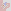

The area is 1W here as well.

<!---->

And here is the case for 2 distance, with 1W area:

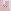

<!---->

<b>4. Double obstacle outside</b>

It is a straight obstacle case with extended area where two close obstacles are present outside. The area is 1W according to following illustrations:

If we enter later at the first black field, the corner white will have to be filled.
If we enter at the first white field, we collide with the closest close obstacle.

<!---->

The same area definition at 3 distance will solve Triple Area Exit Down, making the previous solution obsolete. The area is now W = B.

Instead of an upper obstacle, here we have a C-shape, but its function is the same.

<!---->

There can be two obstacles outside with a different start area as well:

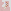

If we step straight, there are two ways to fill an 1W area. In the first, we collide with the end obstacle, and in the second, the start obstacle.

<!---->

Increasing the distance by 1 and the area to 2W, in order to make the area, we either have fill the last white field alone or the first as a corner. The middle white will be either entry or exit point, with the preceding/following field the neighbor black:

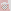

<!---->

And the pattern can be extended along a stair:

The area is 2B. If we enter now, we have to exit at a black field and then fill the remaining to as corners.

<!---->

Similarly:

In the left representation, we enter at the first left field. On the right, we entered at the first black and exit there. In either case, if the area is 2W, we cannot enter later.
<!---->

<b>5. Start obstacle outside</b>

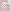

With a 2W area, if we step straight, we have to step right afterwards. This conflicts with the obstacle on the right.
This and the previous rule can be made universal to include distances to the first obstacle increased by a multiple of 4.

<!---->

The area is the extended version of the y vertical distance, 0 horizontal distance rule. (The first area we examined, at page 71.) It is not necessary to decide whether we can enter now or later, it is already taken care of by the other single area groups. But there is a close obstacle at the entry point outside the area. If, at 4 distance, the area is 1W, we enter at the first white field, from which we step down and left.
Therefore, we cannot enter later.

<!---->

Here, we have to extend the area of the previous example along the short axis. The area is still 1W.

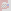

But we don't have to define this area separately. The x and y distance obstacle will solve it too:

<!---->

It can be proved that the corner at (3,3) position does not do anything, so it is not a double obstacle outside case. The rule still holds if we move that obstacle.

<!---->

In the next example, the area is xB where x is the height of the stair representation.

If we enter now, the corner blacks will have to be filled separately, so we must exit the first line at the last black field. This will conflict with the mid across obstacle.

<!---->

<b>6. End obstacle outside at x and y distance</b>

We began the border movement rules with end obstacles that were close relative to the exit point. This has to be extended so that if we find any corner at x and y distance in the upper left quarter that makes up an area we cannot enter later, the rule applies. But first, let's look at some cases we have missed.

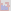

The area is 1B. If we enter now, we have to reserve the first corner black for later, so we exit at the second black for the first time. There have been found a case where the end obstacle can be in across position as well.

<!---->

And the next is the extension with the second area:

Here, the first area is 1B, so if we enter now, we will exit at the first black field, coming from above. This creates a second area, which is 1W, so we cannot enter it later.

<!---->

The followings are variations, with different start areas.
Here, the area is 1B:

W = B:

<!---->

W = B:

When we have an obstacle 2 horizontal and 3 vertical distance away, and the area is 1B, the corner black has to be filled separately, and the border movement will make up a stair. For the second step, the area with the new obstacle is 1W, so we cannot enter it later.

<!---->

This is the stair pattern from page 150, which we had abandoned in favor of area rules. We have already worked it out at a lesser distance:

So to make it universal, we can say that if the vertical distance (y)&nbsp;=&nbsp;horizontal&nbsp;distance&nbsp;(x)&nbsp;+&nbsp;2, and the area is xB, and we have the second obstacle present, we cannot enter now.
Is the second obstacle a close obstacle relative to the field 1 left and 2 up, or can it occur at any point of the stair? Can it be a far obstacle, creating an area we must enter? We need examples to answer there questions.

<!---->

But here is another stair case. This time the entry point is from below.

The examined area is 1B. Only stepping up has to be disabled, we can step left and enter the area going 2 up, 1 right, 1 down and 1 right. An extension of this would look like:

If the horizontal distance to the first obstacle is x, an xB area satisfies the condition.

<!---->

The next example shows a stair where there is a far obstacle at the end.

<!---->

If we reverse the horizontal and vertical distance for the first obstacle, we find ourselves in a similar situation.

In order to make the 1B area, we need to exit at the second black field, and a stair pattern will be drawn from there.
Again, the distance can be increased, the area is now 2B:

<!---->

<b>7. Stair patterns</b>

It is the first case of sequence (page 142) where multiple steps have to be applied, just like we did at the second and third case.
But let's phase out sequences and solve them in a different way that gives a recognizable pattern.

Next to the remote stair, a similar path will go the opposite way. This creates two across obstacles with the live end and the taken field down left. If we step up, the blue fields can neither be filled before or after walking through the stair.
I will call this Double Stair.

<!---->

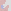

In this case, the line would continue on the right after exiting the area until it conflicts with an obstacle on the opposite side.

On the right a theoretical extension is shown.
For now, we apply the mid across obstacle to the last step, and the across to the last before one, but there might come other combinations, like in the next case:

<!---->

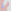

<!---->

Second case (page 145). Until now, we only checked for C-shapes and close obstacles on the left side when we exit an area, and now we need to add corner discovery to find an obstacle at any x and y distance that creates an area we have to enter now. 

In the next one, the area is on the right side.

<!---->

And here, the sequence has to be applied on the opposite side of what we are used to.

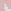

A new start area might occur in the form of a next step C-shape. In this, there is a regular stair pattern that leads to an area on the right side.

<!---->

There can also be two close obstacles in the end:

And here is an example where the sequence is not only a stair but changes direction twice.

<!---->

We know the area and the border movement of the following case.

Until now, we checked for end obstacles at the white corner, but given the known exit field, we should also check for two close (and maybe far) obstacles on each side.
And indeed, the left side turns out to be a far obstacle here:

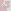

<!---->

There can also be a sequence by going along the left side here:

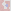

<!--When the distance to the first obstacle is over 3, the chances are no sequence exist, because the line can exit and re-enter the start area, filling some fields outside of it.-->

<!---->

This is a perfect example of a sequence that travels along the edges, not filling the center.
For start pattern, we check the following:

It is also obvious that it has two rotations.

<!---->

<b>8. Area end sequence</b>

This can be considered as the fifth start area of sequence, but what in reality happens here is that we start with an 5&nbsp;x&nbsp;3 area which is 1B, and in order to fill it after entering at white, we have to exit at the farthest black and then fill the corner black separately.
But when we exit for the first time, a stair shape will force the line on a course that leads to a C-shape on the left and a close across obstacle on the right. The corner black will therefore not be filled.
In the program, we apply sequence after discovering a start area like this. We may consider extending the rule for a larger horizontal distance, adding +1B value for every 4 extension, but it is not safe to do so, because then the area can be filled even if we do not exit at the farthest black for the first time.

<!---->

<b>9. Reverse stair</b>

The line in this case has to make a stair as shown on page 179-181, but now we are entering from the end.

Having a W = B area, we either need to enter or exit at the white field. It is an extension of the double obstacle outside rule (page 172-173).

There have been found cases where the left obstacle is mid across, and the right obstacle is a C-shape.

<!---->

<b>10. Reverse stair 3 obstacles</b>

At every 10 million attempts, a pattern like this emerges:

It is easy to see the parts that contribute to the case being impossible, but how do we define a universal or simplified rule?
Below the first pattern descibes the exit point of the pair area (A), while the second is the border movement rule with the end obstacle at the start point B.

In order to fill the marked area with respect to the end obstacle, we need to enter at either C or D. But because of E, we cannot step from A to C, and because of E and F, we cannot reach D.

<!---->

The next example will shed more light onto the pattern.

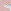

If we make a stair shaped pattern that leads up to the first obstacle, it is clear that there are only two possible entry points if the second obstacle is taken into account.
- 1 straight
- 3 straight and 2 right

Now let's check if we can get to any of these fields and enter the area afterwards.

It is evident that if we step straight, we cannot step right because of the C-shape on the left.

<!---->

But how do we explain that we are unable to get to the far entry point?

In the following representation the three important obstacles are shown. The area occupied by the stair is dark gray, and the return path by the far obstacle we must leave empty is light gray. We need to get to point A.

We can check for a left close obstacle at the first green field, and a left and right close obstacle at the second.

Theoretically, if we extended the length of the stair by one, the following fields would have to be checked:

Because of the stair shape, it is certain that we would enter the second green field from below.

<!---->

The next case uses the stair area described in the previous chapter, so that it has 3 fields in the top row. Because of the blue obstacle, A is the entry point, and similarly to the previous example, we get stuck at the green field if we do not enter now.

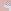

No more cases are found after several days of running. It is time to move on to the 13&nbsp;x&nbsp;13 board.

<!---->

An example for the Reverse stair 3 obstacles is quickly found where the stair is a step longer.

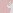

<!---->

And, here is the next one to figure out:

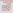

We have seen this pattern before. It is the Double obstacle inside (page 169), but now it starts with a stair.

Since the area is 1W, we enter at the first white field and exit at the second. The black in between will be either filled after entry or before exit. In both cases, there is a close obstacle in the way.
It is easy to see that the stair part can be extended to any length.

<!---->

And also, the top can be a field longer, so it will solve the second case of Double obstacle inside as shown on page 170:

<!---->

Wherever we get stuck and see a 3-long indentation in the taken area, we can suspect a double obstacle pattern. 

The next example would be another variation, only the upper obstacle does not need to be checked due to the fixed movement on the area borderline.

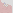

The result is a Start obstacle inside pattern (page 166). While at that time we only looked at the 0 horizontal distance obstacle, now it is at 1 distance, but the examined area is the same.

<!---->

We can also make the rule general by adding stairs to the beginning. As long as the area is 1W, a start obstacle should be checked.

<!---->

In the next example, the 3-long wall on the left together with the stair going downwards right encloses and area where the live end makes a near obstacle with one of the fields on the borderline. 

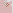

To start with, we can search for a corner obstacle enclosing a big area; its relative y coordinate must be x + 3. From there, taking each field to left and down, we check for the closest wall on the left side. If it is 2 distance away, the pattern is found and depending on the number of steps taken, the live end now acts as a close mid across obstacle, so we can only step left. Of course, the area has to be white = black.
In theory, the live end can also be a close across obstacle. In that case, the corner obstacle is y = x + 4.

<!---->

This is a variation of the double obstacle inside pattern at 4 distance (page 169):

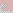

This time, we have a C-shape at the far end. This can be applied to any of the three other distances as well.

<!---->

11&nbsp;x&nbsp;11 estimates

9&nbsp;x&nbsp;9 total: 2 688 307 514

Multiplications when increasing the board:
3 to 5: 104/2 = 52
5 to 7: 111712/104 = 1074.15
7 to 9: 2 688 307 514 / 111 712 = 24064.63

Added number of fields respectively:
+16 fields
+24 fields
+32 fields

Bases per added field:
16√52 = 1.2801
24√1074.15 = 1.3375
32√24064.63 = 1.3706

Differences of bases:
0.0574
0.0331

Next difference estimate: 0.0331&nbsp;*&nbsp;331/574 = 0.0191
Next base: 1.3897

2 688 307 514&nbsp;*&nbsp;1.3897 ^ 40 = 1402 trillion (Actual value according to OEIS: 1445 trillion)

<!---->

Exact calculation line:
2688307514 * ((2688307514/111712) ^ (1/32) + ((2688307514/111712) ^ (1/32) - (111712/104) ^ (1/24)) * ((2688307514/111712) ^ (1/32) - (111712/104) ^ (1/24)) / ((111712/104) ^ (1/24) - (104/2) ^ (1/16))) ^ 40

<!---->

Development / correction notes

<b>Developments:</b>

Calculate next step enter left and right for any AreaUp and Corner distance. (page 129)
Extend 0720_3 case to any horizontal distance (page 180)
Check if opposite empty fields should be disabled at certain rotations of the 4 single area rule groups. (fx. LeftRightAreaUpExtended closed corner 4: Cannot step down). A safety check can be impelmented: if the left and right direction is available but the straight direction is disabled, and there is not a close obstacle/corner on both sides, it is an error.

<b>Improvements:</b>

Use new CornerDiscovery function everywhere
Review rules if they have unnecessary rotations when disabling a field, fx. straight j = 2 enter later
Review CountArea old and new algorithms
Do not disable a possible field (and display the area) if the field is taken anyway (0725_4, 0731 step straight)
All Sequence patterns should be replaced with stair-area rules like 0725_5. Is it possible? At 0726_2, applying sequence is unnecessary. 

<!---->

<b>Display:</b>

Should we display non-critical border movements in rules? Fx. 0624 vs 0727_1 solutions (page 177-178)
Indicate needed disabled fields in 11&nbsp;x&nbsp;11 rule representations?
New pictures where areas were displayed incorrectly.
Cite page numbers when mentioning a rule
Next step left/right areas could be shown in program
Specify future line extension and connection rules on page 3?
The corner discovery head can be in any of the 4 quarters and the area is still closed at the right position. Only stop when reaching the corner or passing by the live end.

<b>Find example:</b>

StartObstacleInside corner (nextY - nextX) % 4 = 2 (0619 extension, page 207)
RemoteStair across (0818_1, page 207)
Stair extensions: flat top far away (0725_6) where the end obstacle is far away. 
StraightSmall 2 and 3 with stair leg, like StairAtEndConcave5 and 6.
StairAtEndConcave6 with other than 2 x mid across obstacles 

<!---->

<b>To do:</b>

Solve all sequence cases with a pattern:
0516_4/0516_5 added to Double Stair / Sequence2 
0516/0516_1 became Sequence2
0516_6/0516_7/0516_8 became SideStair -> It should be incorporated into Sequence2
Sequence case 4 can be incorporated into Sequence2 (0723). Start obstacle is a stair instead of a straight far obstacle.
Further examples of Sequence2: 1001, 1005
Modify Sequence2: In case of stepping down, the sequence will run on the right side (0516 is valid, error case 1 is not)

StairAtStart: are there 5 and 6-distance top stairs?
Hypothesis: A wrong rule that unnecessarily disables a field does not only limit the number of walkthroughs but will result in a stuck case.
Page 180: rewrite corner 5 1 extended stair 2.svg for stair at end convext straight.
0516_2 is both StairAtEndConvex and StairAtStart (representation: StairAtEndConvex 3 1 now nostair.svg and StairAtEndConvex 3 2 now nostair.svg)
Make pattern set representation: 0625 can be extended vertically, holding a fixed 2 horizontal distance, or in a stair at the far end, so that vert = hori + 2. The two can also be combined. The same can happen with 0625_1, which is just one vertical distance shorter. (Stair extension: 0712)

<!--

Previously we used open corners:

Now we have to make calculations for the close corner cases:

In this specific case, the distance is 3, and the area is 1 black.-->

<!--Now I give you another case to think about. It was discovered by the program previously as 51 015 231.
The second picture is the probable point of choice.

-->

<!-- Write about optimizing performance / checking close rules first. Is checking next step posibilities necessary? Add 743 056 case to Check3DoubleArea in documentation; add general case where the farthest corner field has to be stepped on separately. There we should check for close obstacles. 

In Double Area, checking C-Shape is not necessary, side straight will take care of it, because area is 1B.

Double Area first case rotated is the same as Down Stair when there is a mid across obstacle
0529: Double Area first case rotated does not need left C
0529_1: Double Area second case does not need left C
0529_2: Double Area first case does not need left C
0529_3: Double Area third case becomes first case with the obstacle straight ahead (intending left C)
0529_4: Double Area third case needs across
0529_6: Double Area first case and first case rotated needs mid across + across
0529_7: Double Area second case needs mid across + across
0602: Double Area second case needs to be rotated CCW

Directional Area rule has to be rotated to start with.

Disable move while task running

2034760 Is a Directional Area, where the obstacle is across. Find bigger example where Sequence first case is not activated.
Is Directional Area activated at all if distance is bigger than 4, or CheckStraight will disable the fields?

Replace two images with one where the path changes color at the decision point.

Sequence second case:

227 130, Square 4 x 2 C-Shape: Mid across / C-shape left, across right
231 960, Square 4 x 2 Area: Mid across left, across right
2 022 763, Double Area Stair: C-shape, C-shape left, across right
19 720 122, Triple Area Stair: Mid across, C-shape left, across right
0531: Directional Area is the same as Sequence second case (with C-shape on the left at the area exit, only Mid Across seem to exist on the right)

Sequence third case:

2 023 198, Double Area Stair 2 C-shape, C-shape left, across right
19 720 614, Double Area Stair Area C-shape, mid across left, across right

0531_4: New sequence case

When stepping back on completion, what if the left and right field is possible? Then we need to turn twice to the right.

-->

<!--Side straight cases, small area:

Big area:

-->